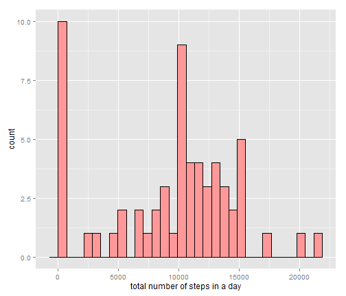
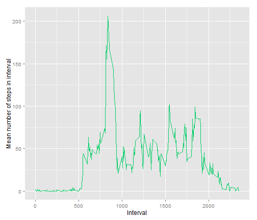
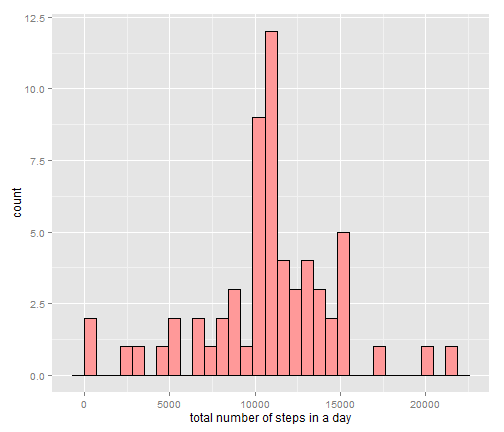
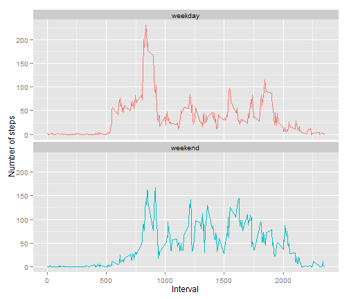

# Reproducible Research, 1st peer assignment

## Loading and preprocessing the data

The first required step was to read and process the data. I unzipped the file activity.zip using R's unzip command and then read the file using read.csv.


```r
wdir<-'C:/Users/Michael/Documents/GitHub/RepData_PeerAssessment1'
setwd(wdir)
unzip('activity.zip')
df <- read.csv('activity.csv')
```

For the time being, no further preprocessing was done. Conversion of dates and mean imputation will follow later.

## What is the mean total number of steps taken per day?

First, we group by the date and compute the mean. NaN-values are ignored by setting na.rm=TRUE.


```r
dailysteps <- aggregate(df$steps,list(Day=df$date),FUN=sum,na.rm=TRUE)
```

Then we plot the histogram for the steps. The aggregated sums of the steps are in the x-column of the dailysteps dataframe.


```r
library(ggplot2)
ggplot(dailysteps, aes(x=x)) + geom_histogram(fill="#FF9999", colour="black") +
  ylab('count')+xlab('total number of steps in a day')
```

 

From the histogram we see that there is a significant number of days with very close to zero total steps. This may be due to the significant proportion of missing data.
Then we output the mean and median numbers of total steps in a day:


```r
mean(dailysteps$x)
```

```
## [1] 9354
```

```r
median(dailysteps$x)
```

```
## [1] 10395
```
The mean is about 9354 and the median is 10395.

## What is the average daily activity pattern?

The aggregation process for the intervals is very similar to the daily aggregation. This time, however, we group by the interval column and take the mean of the steps instead of the sum.

```r
intervalsteps <- aggregate(df$steps,list(Interval=df$interval),FUN=mean,na.rm=TRUE)
```
Then we plot a line graph for the average steps over each interval. The aggregated means can be found in the x-column of the intervalsteps.

```r
ggplot(intervalsteps, aes(Interval)) +
  geom_line(aes(y=x),color='springgreen3') +
  ylab('Mean number of steps in interval')
```

 

From the intervalsteps-dataframe, we can find the interval with the greatest mean number of steps.

```r
intervalsteps[which(intervalsteps$x==max(intervalsteps$x)),'Interval']
```

```
## [1] 835
```
It is the interval between minute 835 and minute 840.

## Imputing missing values

First we count the number of missing cases, i.e. the number of rows with any missing data.

```r
sum(!complete.cases(df))
```

```
## [1] 2304
```
There are 2304 rows with missing data.
I chose to replace the NaNs by using interval-grouped groupwise means. A helpful example was found on stack-overflow.

```r
#http://stackoverflow.com/questions/9322773/how-to-replace-na-with-mean-by-subset-in-r-impute-with-plyr
library(plyr)
impute.mean <- function(x) replace(x, is.na(x), mean(x, na.rm = TRUE))
df_filled <- ddply(df, ~interval, transform, steps = impute.mean(steps))
#ddply messes up the ordering, reorder first by date, then by interval
df_filled <- df_filled[order(df_filled$date,df_filled$interval),]
```
Now we repeat the steps we did previously to find the histogram and the means and medians for the imputed data.

```r
dailysteps_filled <- aggregate(df_filled$steps,
                               list(Day=df_filled$date),FUN=sum,na.rm=TRUE)
```
We plot the histogram:

```r
ggplot(dailysteps_filled, aes(x=x)) + geom_histogram(fill="#FF9999", colour="black") +
  ylab('count')+xlab('total number of steps in a day')
```

 

From the histogram we see that the distribution of the total steps is much more balanced around the center after the imputation.
We calculate the means and medians of the total number of steps in a day:

```r
mean(dailysteps_filled$x)
```

```
## [1] 10766
```

```r
median(dailysteps_filled$x)
```

```
## [1] 10766
```
Somewhat surprisingly, the mean and median are exactly equal, at roughly 10766. Previously, there was a clear difference between the mean and the median as the distribution was skewed by the presence of missing values. Now, the data is very evenly distributed as demonstrated by the fact that the mean is equal to the median.

## Are there differences in activity patterns between weekdays and weekends?

To answer this question, we first need to distinguish between weekdays and weekend days. This can be done using the as.Date and weekdays()-functions:

```r
dates <- as.Date(df_filled$date,format='%Y-%m-%d')
wkdays <- weekdays(dates)
wkdays[wkdays %in% c('Saturday','Sunday')]<-'weekend'
wkdays[!wkdays %in% c('weekend')]<-'weekday'
df_filled$weekdays <- wkdays
```
After this, we need to aggregate the mean number of steps on both the **interval** and the **weekday**:

```r
intervalsteps2 <- aggregate(df_filled$steps,
                  list(Interval=df_filled$interval,Weekday=df_filled$weekdays),
                  FUN=mean,na.rm=TRUE)
```
Then we can generate a panel plot using ggplot's facet_wrap function:

```r
ggplot(intervalsteps2, aes(Interval)) +
  geom_line(aes(y=x,color=Weekday)) +
  facet_wrap(~ Weekday,nrow=2)+
  ylab('Number of steps')+
  theme(legend.position='none') #remove legend
```

 

From the panel plot we can see slight differences in the average steps during weekdays and weekends. During the weekdays, there is a very significant peak at early intervals (around 800 or so), but the activity dies down after this. During the weekend, the early peak is not as stark, and the activity stays higher for a longer time. People tend to sleep later on weekends and be more active in the evening than during the week.
